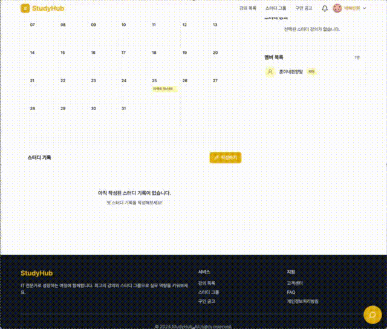

# StudyHub StudyGroup

> 온라인 강의와 스터디 문화를 결합한 IT 학습 플랫폼

이 레포지토리는 StudyHub 서비스 중에서도 스터디 그룹 생성 · 조회 · 리뷰 · 기록 · 일정 관리를 담당하는 도메인 구현을 다루고 있습니다.

- 프로젝트 기간: 2025.11.21 ~ 2025.12.26
- [StudyGroup 배포 링크](https://study.ozcoding.site/)

 

## 🐥 팀원

| GitHub      | 이름   |
| ----------- | ------ |
| @miloupark  | 박혜빈 |
| @Jay-klmnop | 윤지예 |

 

## ✨ 주요 기능

### 스터디 그룹

- 스터디 그룹 생성 및 수정
- 스터디 리뷰 작성/수정
- 스터디 그룹 검색 및 강의 검색

### 스터디 그룹 상세

- 캘린더 기반 스케줄 생성/조회/수정/삭제
- 리더 위임 및 멤버 추방
- 학습 기록 작성 및 AI 요약

### 기타

- 공통 컴포넌트
- 마크다운 에디터
- WebSocket 기반 실시간 채팅
- 스터디 그룹별 채팅방

 

## 🎬 화면 데모

| 스터디그룹 조회                                     | 스터디그룹 검색                                        | 스터디그룹 리뷰                                     |
| --------------------------------------------------- | ------------------------------------------------------ | --------------------------------------------------- |
|  |  |  |

| 스터디그룹 생성                                        | 스터디그룹 수정                                      | 마크다운 에디터                                |
| ------------------------------------------------------ | ---------------------------------------------------- | ---------------------------------------------- |
|  |  |  |

| 스터디그룹 스케줄                                   | 스터디그룹 기록                                | 채팅                                      |
| --------------------------------------------------- | ---------------------------------------------- | ----------------------------------------- |
|  |  |  |

 

## 🛠 기술 스택

### FE

 

 

 

## 📏 Project Convention

### Git Branch

| 종류        | 설명                | 예시    | 설명        |
| ----------- | ------------------- | ------- | ----------- |
| **main**    | 메인 브랜치         | main    | 그대로 사용 |
| **develop** | 배포 전 개발 브랜치 | develop | 그대로 사용 |

 

### Commit Message

| Type         | 설명                                                 |
| ------------ | ---------------------------------------------------- |
| **feat**     | 새로운 기능 추가                                     |
| **fix**      | 버그 수정                                            |
| **style**    | 코드 포맷팅, 세미콜론 누락, 코드 변경이 없는 경우    |
| **refactor** | 리팩토링 (기능 변경 없음)                            |
| **chore**    | 기타 변경사항 (빌드 스크립트 수정, 패키지 매니저 등) |
